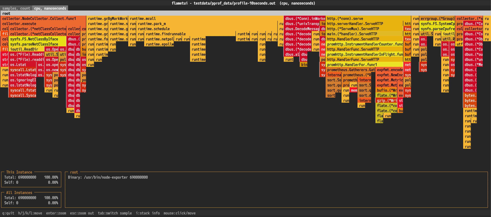

# flametui


A terminal-based flamegraph viewer written in Go, ported from [flameshow](https://github.com/laixintao/flameshow). Navigate and inspect performance profiles interactively in your terminal.



## Features

- **Zero dependencies** — uses only the Go standard library and `syscall`, no external packages
- **pprof support** — parses [pprof](https://github.com/google/pprof) binary profiles (gzip-compressed or raw protobuf)
- **Stackcollapse support** — parses [Brendan Gregg's stackcollapse](https://github.com/brendangregg/FlameGraph) text format
- **Auto-detection** — automatically detects profile format; no need to specify the type
- **Interactive navigation** — keyboard and mouse support for exploring flamegraphs
- **Cross-platform** — builds for Linux, macOS, and Windows

## Installation

```bash
go install github.com/major1201/flametui/cmd/flametui@latest
```

Or build from source:

```bash
git clone https://github.com/major1201/flametui.git
cd flametui
go build -o flametui ./cmd/flametui/
```

## Usage

```bash
flametui <profile-file>
```

### Supported formats

| Format | Description | Source |
|---|---|---|
| pprof | Google pprof binary profile (gzip or raw) | `go tool pprof`, `perf`, etc. |
| stackcollapse | Stackcollapse text format | `perf script`, `py-spy`, etc. |

### Keybindings

| Key | Action |
|---|---|
| `h` / `←` | Move left |
| `j` / `↓` | Move down (to largest child) |
| `k` / `↑` | Move up (to parent) |
| `l` / `→` | Move right |
| `Enter` | Zoom in on selected frame |
| `Esc` | Zoom out |
| `Tab` | Switch sample type |
| `i` | Toggle stack detail screen |
| `q` / `Ctrl+C` | Quit |

### Mouse

| Action | Effect |
|---|---|
| Hover | Highlight frame and show details |
| Click | Zoom in on frame |
| Scroll (flamegraph area) | Scroll vertically |
| Scroll (footer area) | Scroll stack trace |

## Project structure

```
flametui/
├── cmd/flametui/       # CLI entry point
├── pkg/
│   ├── parser/         # Format auto-detection + dispatcher
│   │   ├── pprof/      # Hand-rolled protobuf parser for pprof
│   │   └── stackcollapse/  # Stackcollapse text parser
│   ├── profile/        # Frame tree, PileUp merge, line layout
│   ├── render/         # Flamegraph layout engine + ANSI renderer
│   ├── term/           # Raw terminal I/O (syscall-based)
│   └── tui/            # Full TUI application
└── testdata/           # Test profiles
```

## License

MIT
